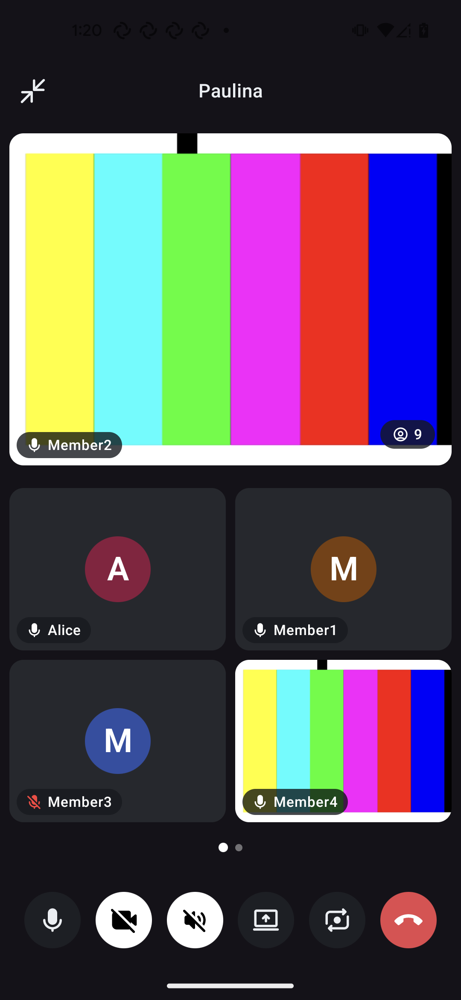

# Element Call Android

A native [MatrixRTC](https://github.com/matrix-org/matrix-spec-proposals/blob/main/proposals/4143-matrix-rtc.md)
call implementation for android: media, session, user interface and the Matrix side, built on
[matrix-rust-rtc](https://github.com/element-hq/matrix-rust-rtc).

<p align="center">
  
</p>


**Status: release candidates.** Versions are `0.x` and every one of them may change the API; releases are GitHub
releases whose assets a Gradle build resolves directly, see [Consuming a release](#consuming-a-release). Maven Central
comes later ([RELEASING.md](RELEASING.md)).

<!--- TOC -->

* [Modules](#modules)
* [Consuming a release](#consuming-a-release)
* [Building](#building)
* [The sample app](#the-sample-app)
* [Host requirements](#host-requirements)
* [Documentation](#documentation)
* [Copyright & License](#copyright-license)

<!--- END -->

## Modules

Five published artifacts under `io.element.android`, one version, plus `element-call-bom` to pin them together:

| Artifact | Project | What it is |
| :--- | :--- | :--- |
| `element-call-api` | `call/api` | the contract: controller, ports, state types, options |
| `element-call` | `call/impl` | the stack, the controller, the foreground service, the Rust core wrapper; no Compose |
| `element-call-ui` | `call/ui` | the composables: screen, minimized bar, floating tile, picture-in-picture, style port |
| `element-call-matrix` | `call/matrix` | the turnkey Matrix transport over the Rust SDK |
| `element-call-test` | `call/test` | fakes and fixtures for hosts' tests, and the colour-bar test pattern |
| not published | `sample` | the harness: a Compose app over the fakes, with the only Activity and the instrumented tests |

See [AGENTS.md](AGENTS.md) for the boundaries between them.

## Consuming a release

The artifacts are not on Maven Central yet. Each [release](https://github.com/element-hq/element-call-android/releases)
carries them as assets, laid out so that Gradle resolves them straight from the release through an Ivy repository,
with their module metadata, POMs and sources; `SHA256SUMS` lists their checksums. The `matrix-rust-rtc` core they
depend on, `io.element.android:matrix-rtc-android`, is resolved the same way from
[its own releases](https://github.com/element-hq/matrix-rust-rtc/releases), which carry the bare AAR.

In `settings.gradle.kts`, next to the repositories the build already has (both blocks are content-filtered, so
nothing else is looked up there, and both go the day the artifacts are on Central):

```kotlin
dependencyResolutionManagement {
    repositories {
        ivy {
            url = uri("https://github.com/element-hq/element-call-android/releases/download")
            patternLayout { artifact("v[revision]/[artifact]-[revision](-[classifier]).[ext]") }
            metadataSources { gradleMetadata() }
            content {
                includeModule("io.element.android", "element-call-bom")
                includeModule("io.element.android", "element-call-api")
                includeModule("io.element.android", "element-call")
                includeModule("io.element.android", "element-call-ui")
                includeModule("io.element.android", "element-call-matrix")
                includeModule("io.element.android", "element-call-test")
            }
        }
        ivy {
            url = uri("https://github.com/element-hq/matrix-rust-rtc/releases/download")
            patternLayout { artifact("v[revision]/[artifact]-[revision].[ext]") }
            metadataSources { artifact() }
            content { includeModule("io.element.android", "matrix-rtc-android") }
        }
        google()
        mavenCentral()
    }
}
```

Then the dependencies, through the BOM so one version pins the five:

```kotlin
implementation(platform("io.element.android:element-call-bom:0.1.0-rc.1"))
implementation("io.element.android:element-call-ui")
implementation("io.element.android:element-call")
implementation("io.element.android:element-call-matrix")
testImplementation("io.element.android:element-call-test")
```

The core's version is fixed by the library's metadata; a host never names it. An unreleased build is consumed
from the local Maven repository instead ([docs/local_stack.md](docs/local_stack.md), layer 3).

## Building

The build needs the `matrix-rust-rtc` core as an Android AAR at `rtc/local/matrixrtc-release.aar` (not committed):

```
./tools/rtc/fetch-rust-rtc            # fetches the release pinned in gradle.properties and checks its sha256
./tools/rtc/build-rust-rtc            # or builds ../matrix-rust-rtc and drops the AAR in place, to work on the core
./gradlew assemble test runQualityChecks
```

[docs/local_stack.md](docs/local_stack.md) explains how to work on the core, this library and Element X at once.

## The sample app

`sample/` is how the UI is developed without Element X: a Compose app over the fakes, with no server, no login and
no camera. Every row of its picker opens a call over the sample's own screen - one to one, a group with a spotlight,
nine people with a paging strip, a shared screen, the minimized bar, the floating tile, and the connecting, failed
and permission states - with colour bars where a camera would be, drawn through the real renderer. Its controls do
what they say (mute mutes, minimize minimizes), a switch overrides the style with a deliberately loud one, and
leaving the app enters picture-in-picture.

```
./gradlew :sample:installDebug
adb shell am start -n io.element.android.call.sample/.SampleActivity --es fixture group   # or any SampleFixture key
./gradlew :sample:connectedDebugAndroidTest                                                # the gesture and pixel tests
```

## Host requirements

Numbered so an integration can be checked against them. Items marked *pending* are settled when the corresponding
code lands.

1. `minSdk` 24 or higher.
2. ABIs `armeabi-v7a`, `arm64-v8a`, `x86_64`. There is no `x86` build of the core; a host that ships `x86` must
   exclude it or accept that the call is unavailable there.
3. The host's Rust SDK version must be at least the one this library was compiled against (see
   `gradle/libs.versions.toml`, `matrix_sdk`).
4. Picture-in-picture: `android:supportsPictureInPicture="true"` and `smallestScreenSize` in `configChanges` on
   the host Activity; `ElementCallPictureInPicture.attach(activity, controller)` from its `onCreate`, and
   `ElementCallPictureInPicture.onUserLeaveHint(activity, controller)` from its `onUserLeaveHint()` override.
   A call ending while floating closes the window (`moveTaskToBack`).
5. Screen sharing is off by default. A host turns it on with `ElementCallOptions(isScreenSharingEnabled = true)`
   and, in the same change, adds `FOREGROUND_SERVICE_MEDIA_PROJECTION` and the `mediaProjection` type to
   `ElementCallForegroundService` in its own manifest, with `tools:node="merge"`; the library's service declares
   only `microphone|camera`. That type is Play-reviewed, so the library does not declare it, and without it the
   first share is a `SecurityException` on Android 14+.

## Documentation

- [AGENTS.md](AGENTS.md): boundaries, commands, conventions.
- [docs/local_stack.md](docs/local_stack.md): the local development stack.
- [docs/screenshot_testing.md](docs/screenshot_testing.md): the Paparazzi screenshot tests.
- [RELEASING.md](RELEASING.md): versioning, cutting a release, and what must never be published.
- [CHANGES.md](CHANGES.md): the changelog.
- [CONTRIBUTING.md](CONTRIBUTING.md): how to submit a change.

## Copyright & License

Copyright (c) 2026 Element Creations Ltd.

This software is dual licensed by Element Creations Ltd (Element). It can be used either:

(1) for free under the terms of the GNU Affero General Public License (as published by the Free
Software Foundation, either version 3 of the License, or (at your option) any later version); OR

(2) under the terms of a paid-for Element Commercial License agreement between you and Element (the
terms of which may vary depending on what you and Element have agreed to).

Unless required by applicable law or agreed to in writing, software distributed under the Licenses is
distributed on an "AS IS" BASIS, WITHOUT WARRANTIES OR CONDITIONS OF ANY KIND, either express or
implied. See the Licenses for the specific language governing permissions and limitations under the
Licenses.
